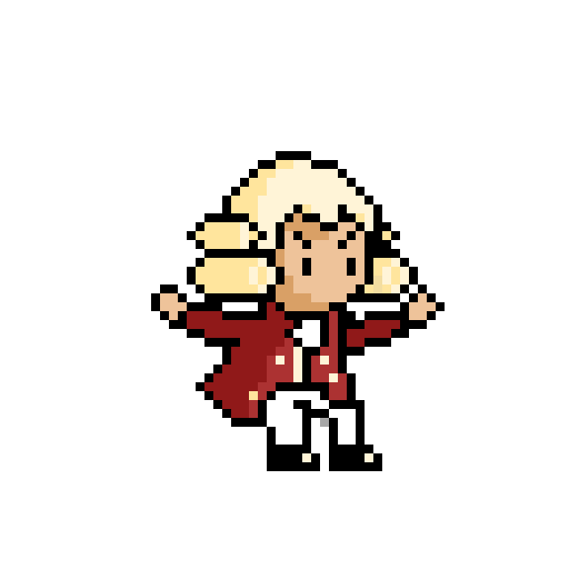
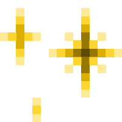
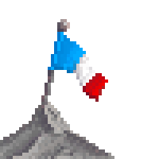
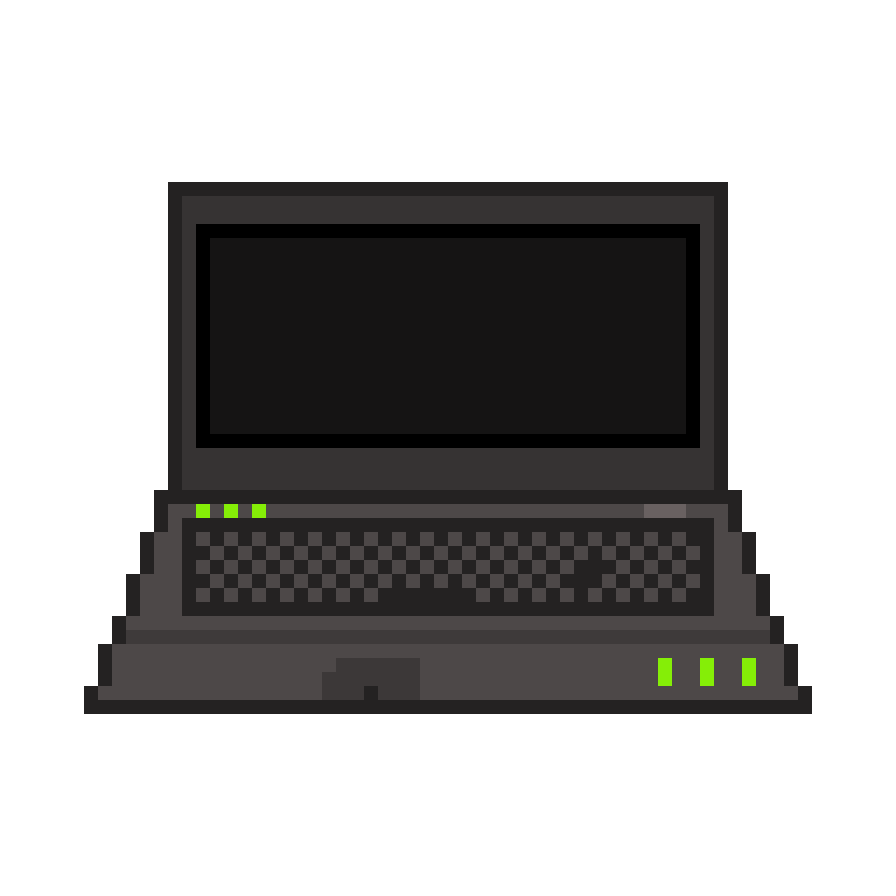
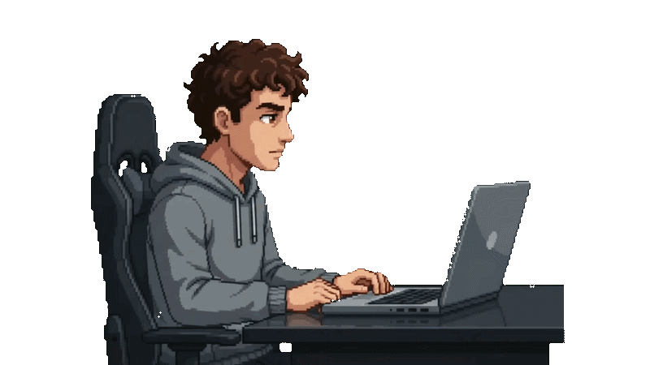
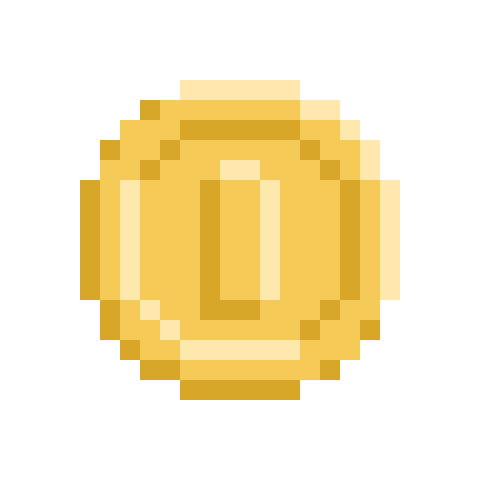

<h2> Hi there, I'm Soan </h2>

<p><em>
  🚀 Fullstack Developer & Tech Enthusiast 
  <br/>
  🇫🇷 Based in France 
  <br/>
  💻 Passionate about building web apps 
</em></p>

<!-- Image / GIF aligné à droite de la section -->


### A little more about me... 

```javascript
const soan = {
  pronouns: "he/him",
  code: ["TypeScript", "JavaScript", "Python", "Rust", "C", "C++", "C#", "Java", "PHP"],
  roles: ["Fullstack Developer", "Learner", "Creator"],
  currentFocus: "Building cool fullstack projects & modern web tools",
  interests: ["Web Development", "UI/UX Design", "Pixel Art"]
}
